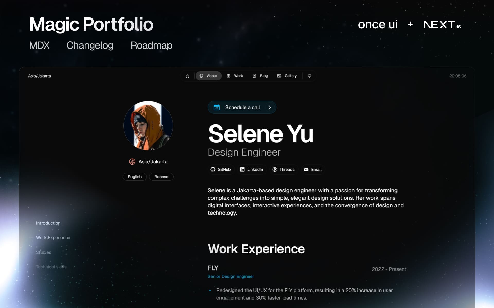

# DevOtaku Portfolio Website

Professional portfolio website for DevOtaku - Stockholm-based software development studio specializing in modern web applications, AI agents, and custom software solutions.

🌐 **Live Site**: [https://team-kanyarasi.github.io/portfolio-website/](https://team-kanyarasi.github.io/portfolio-website/)



## 🚀 Quick Start

**1. Clone the repository**
```bash
git clone https://github.com/Team-Kanyarasi/portfolio-website.git
cd portfolio-website
```

**2. Install dependencies**
```bash
npm install
```

**3. Run development server**
```bash
npm run dev
```

**4. Build for production**
```bash
# For regular deployment (VPS/server)
npm run build
npm start

# For static export (GitHub Pages)
npm run build:static
```

## 🏗️ Project Structure

```
src/
├── app/                    # Next.js App Router pages
│   ├── about/             # About page
│   ├── blog/              # Blog with MDX posts
│   ├── contact/           # Contact form
│   ├── services/          # Services offered
│   ├── team/              # Team profiles
│   └── work/              # Portfolio projects
├── components/            # React components
└── resources/
    ├── content.js         # Business content & team info
    └── once-ui.config.js  # UI configuration
```

## 📝 Content Management

### Update Business Information
Edit `src/resources/content.js`:
- **Company details**: Name, location, contact info
- **Services**: Offerings, pricing, features
- **Team members**: Profiles, skills, social links
- **Testimonials**: Client reviews and feedback

### Add Blog Posts
Create new `.mdx` files in `src/app/blog/posts/`:
```markdown
---
title: "Your Post Title"
publishedAt: "2024-01-15"
summary: "Post summary"
author: "Author Name"
---

Your content here...
```

### Add Portfolio Projects
Create new `.mdx` files in `src/app/work/projects/`:
```markdown
---
title: "Project Name"
publishedAt: "2024-01-15"
summary: "Project description"
image: "/images/projects/project-cover.jpg"
---

Project details...
```

## 🎨 Tech Stack

- **Framework**: Next.js 15.3
- **Styling**: Once UI Design System + Sass
- **Content**: MDX for blog posts and projects
- **Deployment**: GitHub Pages (static export)
- **TypeScript**: Full type safety
- **SEO**: Automatic sitemap, robots.txt, meta tags

## 📦 Available Scripts

```bash
npm run dev          # Development server
npm run build        # Production build
npm run build:static # Static export (GitHub Pages)
npm start           # Start production server
npm run lint        # Run ESLint
```

## 🌐 Deployment

### GitHub Pages (Current)
Automatically deploys on push to `main` branch via GitHub Actions.

### Other Platforms
- **Vercel**: Connect repository for automatic deployments
- **Netlify**: Drag & drop the `out/` folder after `npm run build:static`
- **VPS/Server**: Use `npm run build` and `npm start`

## 🔧 Configuration

### Domain & SEO
Update `src/resources/once-ui.config.js`:
```javascript
const baseURL = "https://your-domain.com";
```

### Theme & Styling
Customize colors, fonts, and layout in the Once UI config files.

## 🏢 About DevOtaku

DevOtaku is a Stockholm-based software development team delivering:
- **Modern Web Applications**: Next.js, React, TypeScript
- **AI Agent Development**: Custom AI solutions and automation
- **Full-Stack Development**: End-to-end application development
- **Technical Consulting**: Architecture planning and code reviews

**Contact**: hello@devotaku.com  
**Location**: Stockholm, Sweden  
**Timezone**: CET (UTC+1)

## 📄 License

This project is based on the Magic Portfolio template by Once UI, distributed under CC BY-NC 4.0 License. 

- Attribution is required
- Commercial usage of the template is not allowed
- The content and customizations are owned by DevOtaku

## 🤝 Contributing

This is a company portfolio website. For business inquiries or collaboration:
- **Email**: hello@devotaku.com
- **GitHub**: [@Team-Kanyarasi](https://github.com/Team-Kanyarasi)

---

Built with ❤️ by Team Kanyaraasi using [Once UI](https://once-ui.com) and [Next.js](https://nextjs.org)